# Lab 01 — Virtual Networking: Design, Deploy & Automate

## 🎯 Objective

Design and deploy a two-network Azure environment to support a growing organization — a core services network built manually through the portal, and a manufacturing network deployed via ARM template — establishing both a repeatable infrastructure pattern and a working understanding of Azure's IP addressing model.

---

## 📐 Design Decisions

Before touching the portal, two networks were planned with **deliberately non-overlapping address spaces**:

| Network | Purpose | Address Space | Why this range |
|---------|---------|---------------|-----------------|
| CoreServicesVnet | Shared business services + database tier | 10.20.0.0/16 | Large future-growth allowance (65,536 addresses) |
| ManufacturingVnet | Sensor/IoT-style manufacturing workloads | 10.30.0.0/16 | Separate /16 block — no collision if these networks are ever peered |

Each network was split into two /24 subnets (256 addresses each, 251 usable after Azure's reserved addresses), separating workload tiers within each network.

---

## 🧱 Task 1 — Manual Deployment via Portal

**CoreServicesVnet** was built directly through the Azure portal to practice the full manual workflow — Basics → Security → Address space → Tags → Review + create.

| Resource | Configuration |
|----------|---------------|
| Resource Group | `az104-rg4` |
| VNet | `CoreServicesVnet` — 10.20.0.0/16, East US |
| Subnet 1 | `SharedServicesSubnet` — 10.20.10.0/24 |
| Subnet 2 | `DatabaseSubnet` — 10.20.20.0/24 |

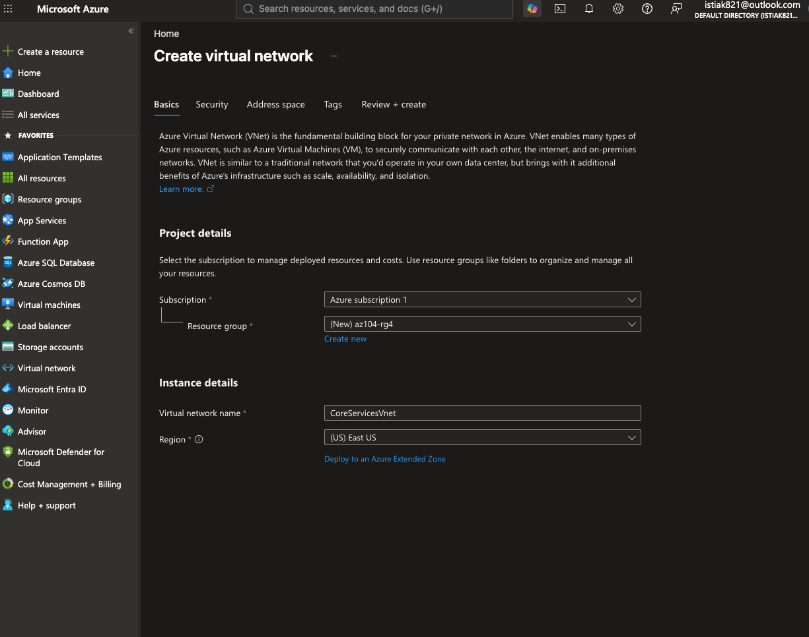

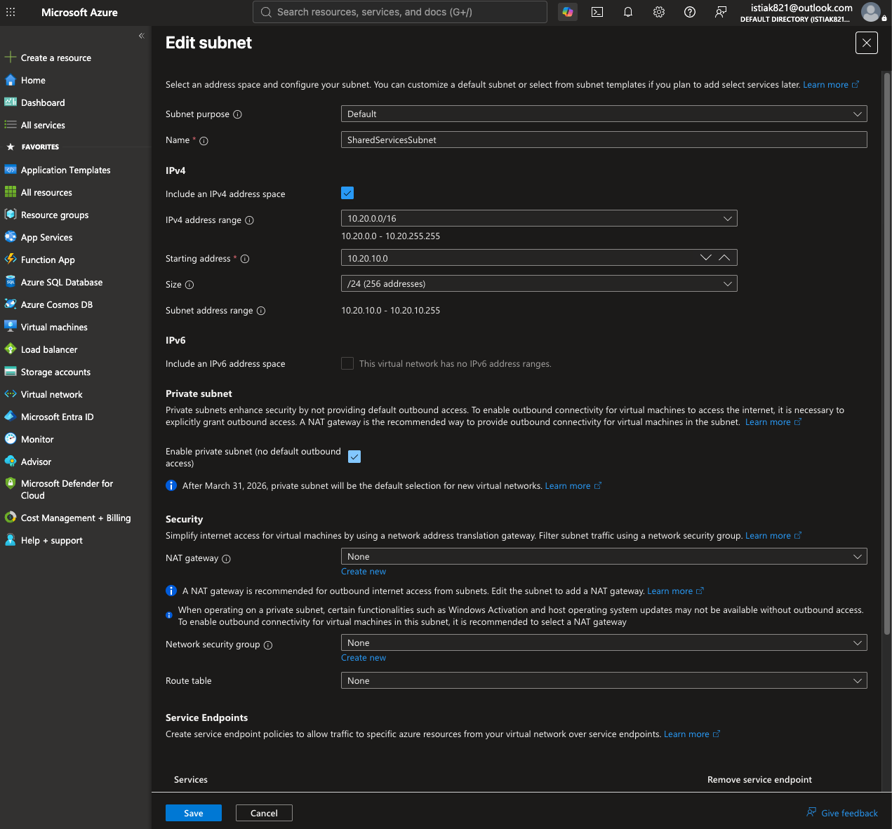

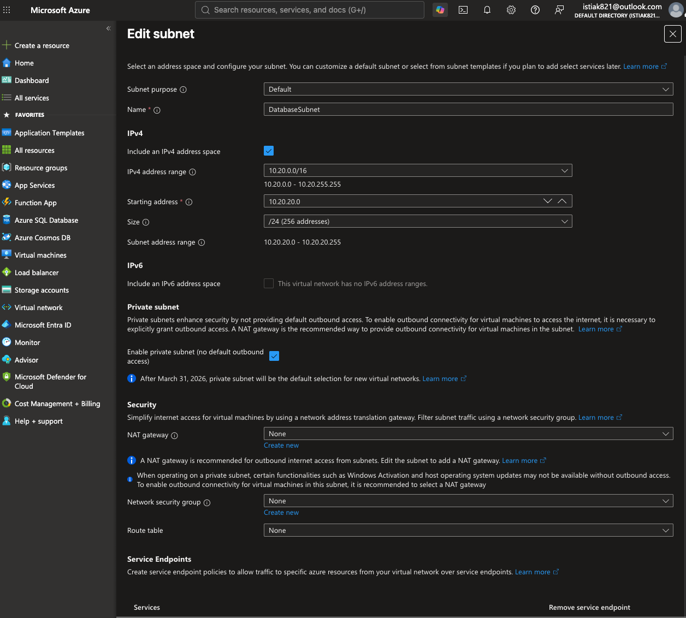

The default auto-generated subnet was deleted after adding the two named subnets — a step Azure's exercise explicitly calls out, since the default subnet's range would otherwise collide with the intended layout.

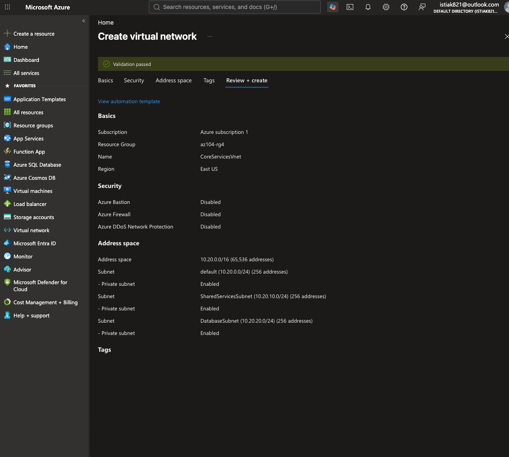

Post-deployment, the VNet's **Capabilities** tab confirms the deployed address space and available add-on features (DDoS Protection, Azure Firewall, Peerings, Private Endpoints) — all currently unconfigured, which is expected for this scope of lab.

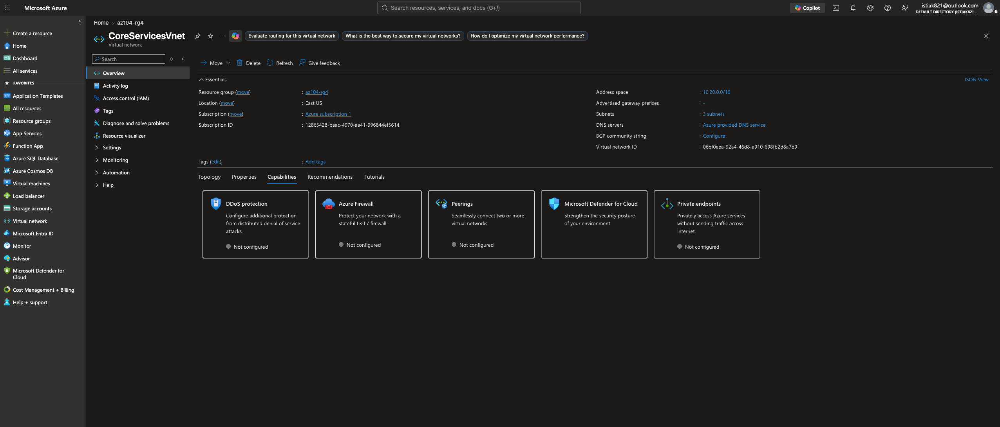

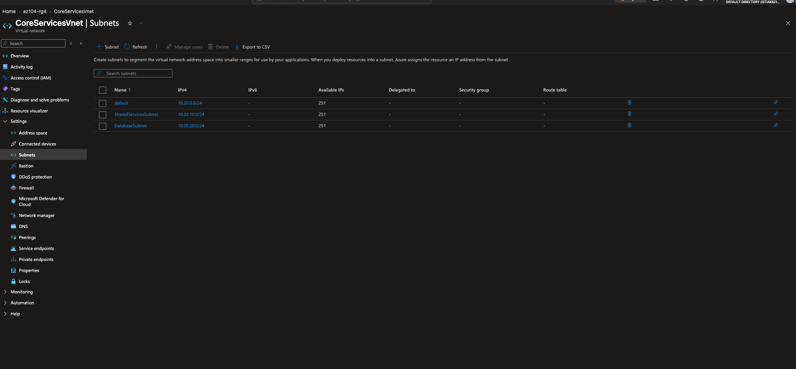

---

## 🧱 Task 2 — Automated Deployment via ARM Template

Rather than repeating the manual portal steps for the second network, **CoreServicesVnet was exported as an ARM template** and then modified to describe `ManufacturingVnet` instead — a practical exercise in Infrastructure as Code and template reuse.

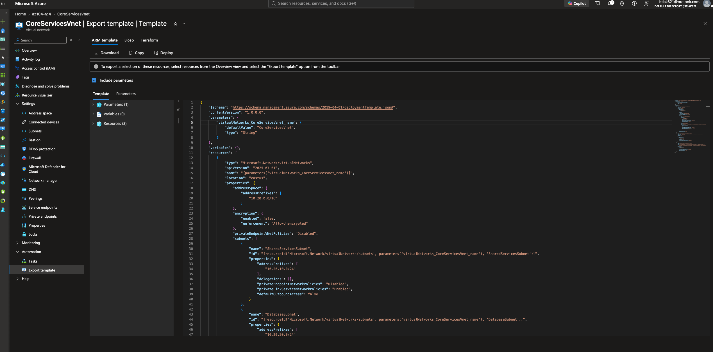
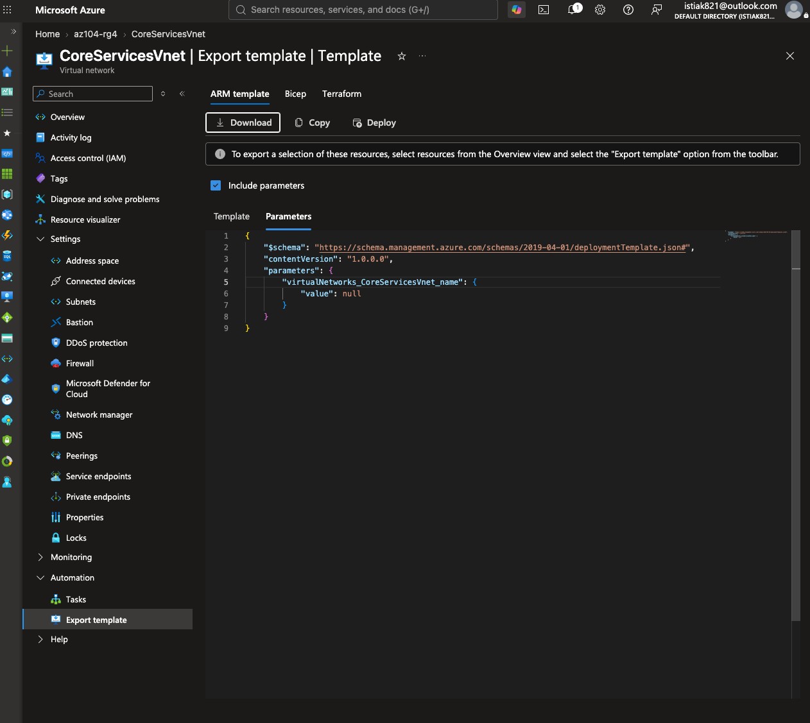

### Editing the Template

The exported template required several targeted changes:
- VNet name parameter default value → `ManufacturingVnet`
- Address space → `10.30.0.0/16`
- Subnet names → `SensorSubnet1` / `SensorSubnet2`
- Subnet address prefixes → `10.30.20.0/24` / `10.30.21.0/24`

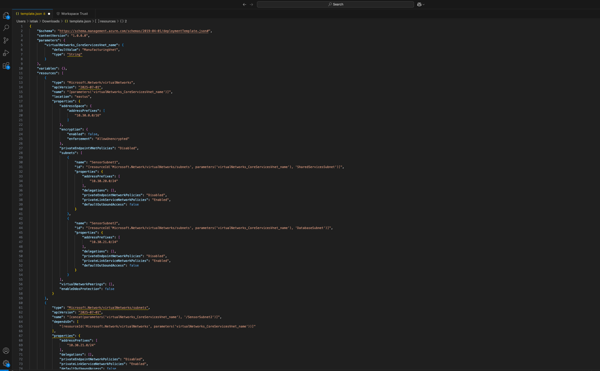
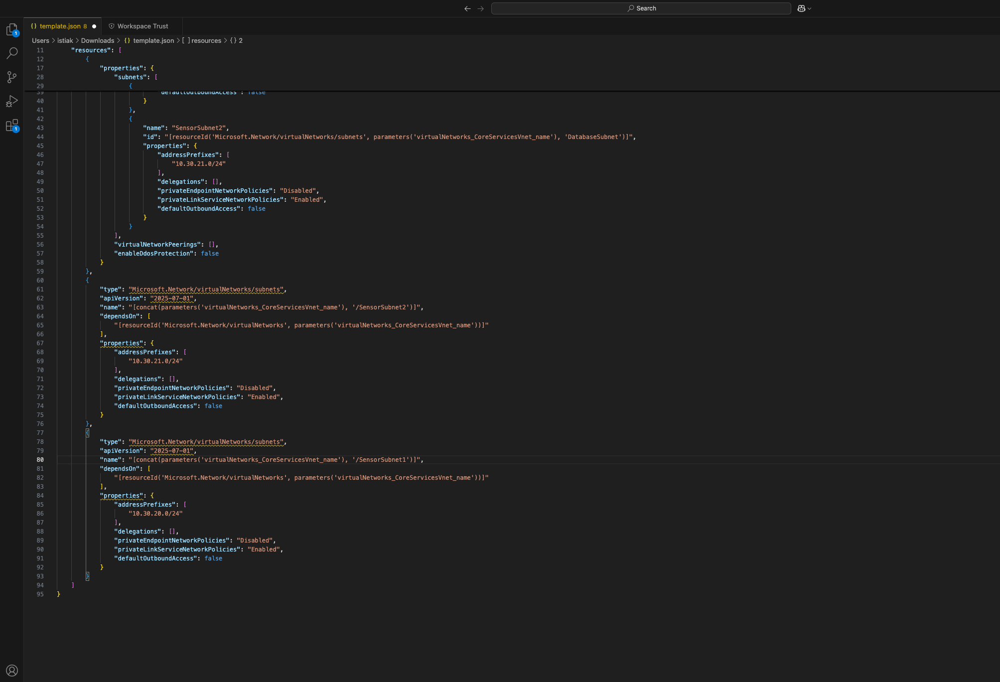
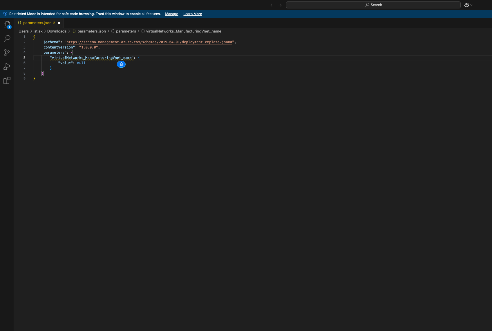

### Template Adjustments

The exported template needed more than a straightforward find-and-replace — Azure's export tool represents subnets both inline and as separate resources, and a few of those references (subnet names, address prefixes, and one JSON syntax issue) still pointed back at the original network after the initial edits. Working through the template line by line to align every reference to the new network turned out to be a good exercise in understanding what an ARM template actually declares, versus what the portal's wizard abstracts away. The corrected, final template used for the successful deployment is included in this repo: [`../templates/manufacturing-vnet-template.json`](../templates/manufacturing-vnet-template.json), alongside its matching [`manufacturing-vnet-parameters.json`](../templates/manufacturing-vnet-parameters.json).

### Deploying the Corrected Template

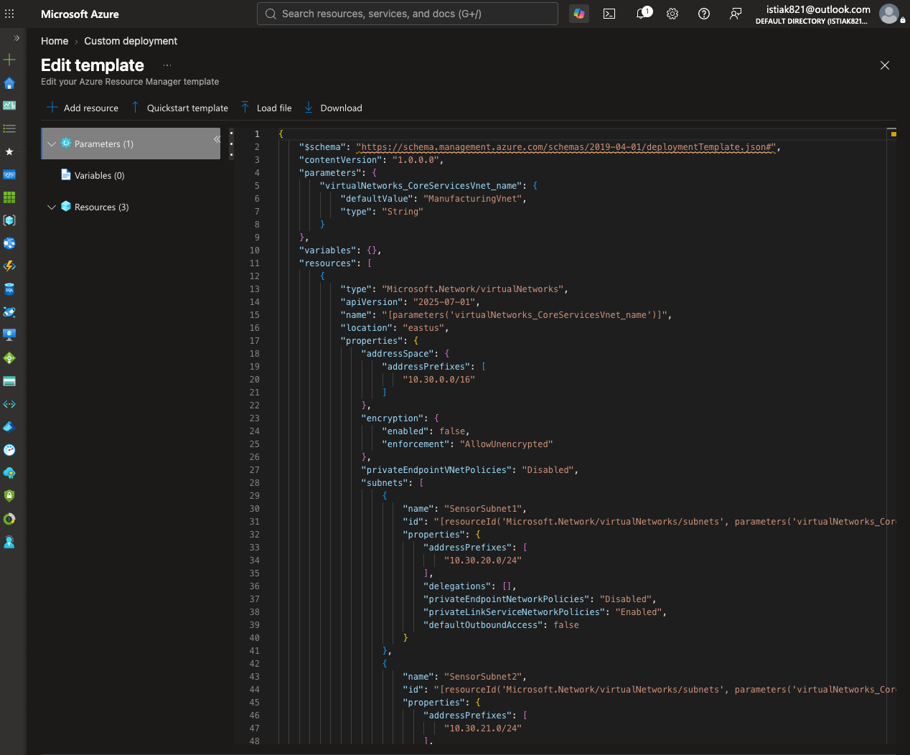
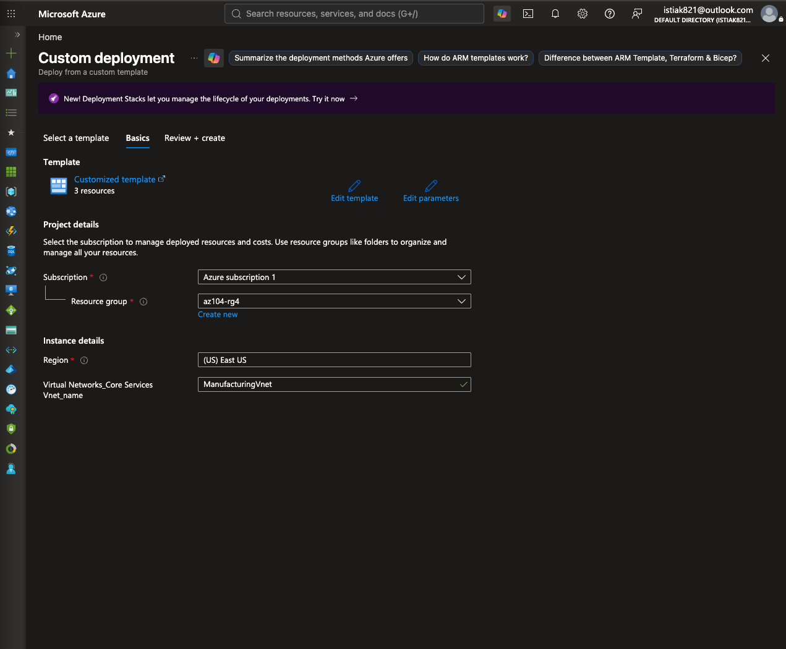

**Result:** both networks deployed successfully into `az104-rg4`.

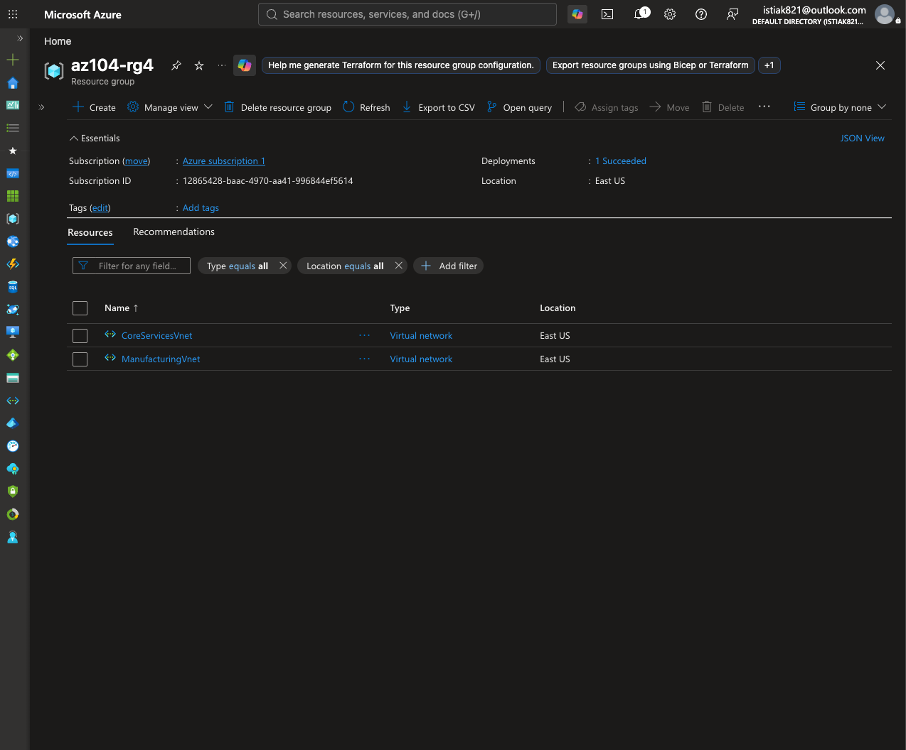

---

## 🧠 Key Concepts Demonstrated

- **CIDR address planning** — designing non-overlapping /16 spaces up front so the networks remain peering-compatible
- **Subnet segmentation and reserved addresses** — Azure reserves 5 IPs per subnet (network, gateway, 2× DNS, broadcast), so each /24 yields 251 usable addresses, not 256
- **Infrastructure as Code** — treating an exported ARM template as a reusable pattern rather than a one-off artifact
- **Template debugging** — reading ARM JSON closely enough to catch stale resource references before deployment, rather than relying on the export being correct as-is
- **Deployment validation** — using the Review + Create tab's built-in validation before committing to a deployment

---

## 💡 What I Learned

The most valuable part of this lab wasn't the successful deployment — it was working through the exported template before it would deploy cleanly. Azure's portal-generated export isn't always ready to use as-is; matching every subnet name and address prefix against the intended design built a much more concrete understanding of what an ARM template actually *is* (a declarative description of desired state) versus what the portal's click-through wizard abstracts away.
