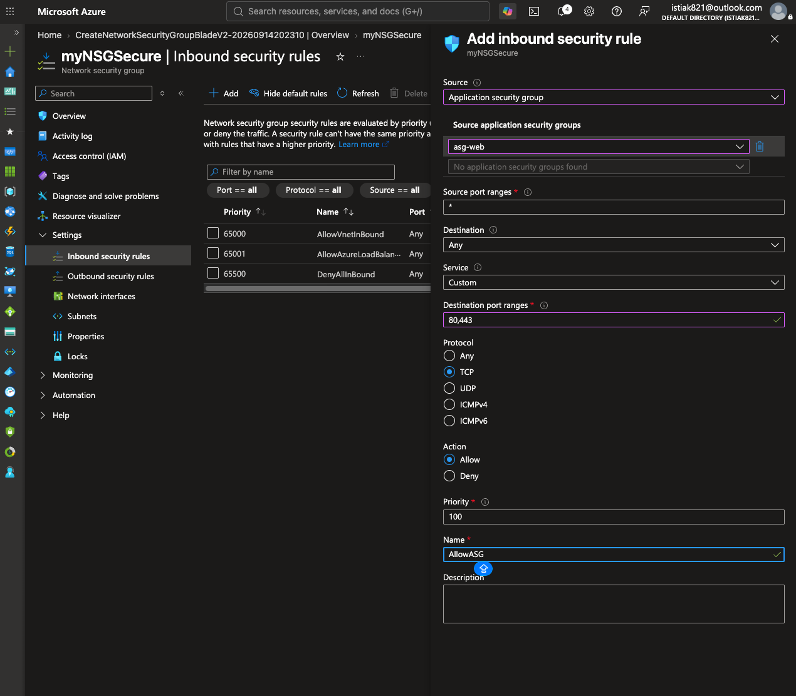
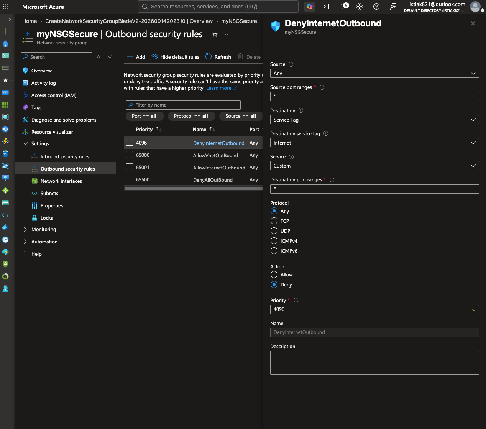
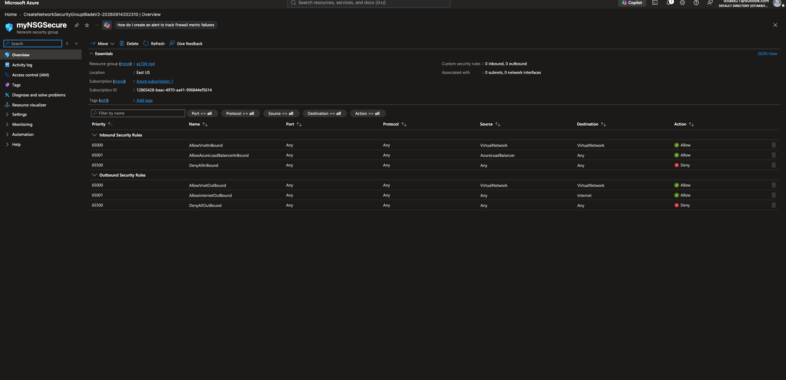
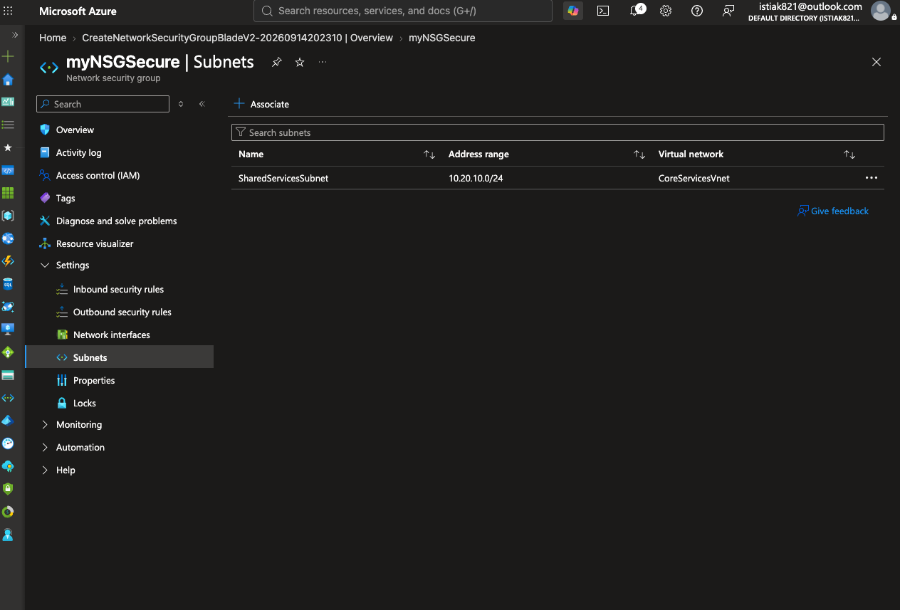

# Lab 03 — Network Security: NSGs & Application Security Groups

## 🎯 Objective

Secure traffic to and from the `CoreServicesVnet` shared services tier using a Network Security Group with explicit inbound/outbound rules, and demonstrate how an Application Security Group decouples security policy from individual IP addresses.

---

## 🧱 What Was Built

### Application Security Group

An ASG named `asg-web` was created to represent "the web tier" as a logical group, independent of which specific VMs or IP addresses end up in it.

| Setting | Value |
|---------|-------|
| Name | `asg-web` |
| Resource Group | `az104-rg4` |
| Region | East US |

### Network Security Group

`myNSGSecure` was created and associated with the `SharedServicesSubnet` inside `CoreServicesVnet`, then configured with two custom rules layered on top of Azure's defaults.

| Rule | Direction | Source | Destination | Port(s) | Protocol | Action | Priority |
|------|-----------|--------|-------------|---------|----------|--------|----------|
| `AllowASG` | Inbound | `asg-web` (ASG) | Any | 80, 443 | TCP | Allow | 100 |
| `DenyInternetOutbound` | Outbound | Any | `Internet` (service tag) | * | Any | Deny | 4096 |

### Verifying the Full Rule Set

The NSG overview shows the two custom rules sitting alongside Azure's six default rules — this is the view that actually matters for understanding runtime behavior, since **all** of these rules are evaluated together, in priority order:

| Priority | Name | Source | Destination | Action | Origin |
|----------|------|--------|-------------|--------|--------|
| 100 | AllowASG | asg-web | Any | Allow | Custom |
| 4096 | DenyInternetOutbound | Any | Internet | Deny | Custom |
| 65000 | AllowVnetInBound / AllowVnetOutBound | VirtualNetwork | VirtualNetwork | Allow | Default |
| 65001 | AllowAzureLoadBalancerInBound | AzureLoadBalancer | Any | Allow | Default |
| 65001 | AllowInternetOutBound | Any | Internet | Allow | Default |
| 65500 | DenyAllInBound / DenyAllOutBound | Any | Any | Deny | Default |

This table makes the actual effective behavior explicit: outbound traffic to the internet is **denied** despite Azure's default `AllowInternetOutBound` rule at priority 65001, because the custom `DenyInternetOutbound` rule at priority 4096 is evaluated first and wins.

Finally, the NSG was associated with the target subnet:

---

## 🧠 Key Concepts Demonstrated

- **Rule prioritization** — Azure NSGs evaluate rules in ascending priority order and stop at the first match; a custom rule at priority 4096 overrides the default `AllowInternetOutBound` at 65001 for the traffic it matches
- **Application Security Groups as a policy abstraction** — the inbound rule references `asg-web` rather than any IP address, so the rule remains correct even as VMs are added to or removed from that group
- **Explicit deny-by-exception** — rather than relying on Azure's default allow-everything-outbound posture, this configuration explicitly closes outbound internet access and would require a specific allow rule (at a lower priority number) for any traffic that legitimately needs it
- **Stateful behavior** — NSGs automatically permit return traffic for any connection that was allowed on the way in, so no separate "response" rule was needed for the inbound web traffic

---

## 💡 What I Learned

Reading the full rule table — custom rules and Azure's defaults together — made it clear that NSG behavior can't be reasoned about by looking at custom rules in isolation. The `DenyInternetOutbound` rule only "wins" because its priority number (4096) is lower than the default allow rule's (65001); if it had been assigned, say, priority 65600, the default allow rule would have taken effect first and the deny would never be reached. That priority-ordering detail is easy to get backwards, and this lab made it concrete rather than theoretical.
