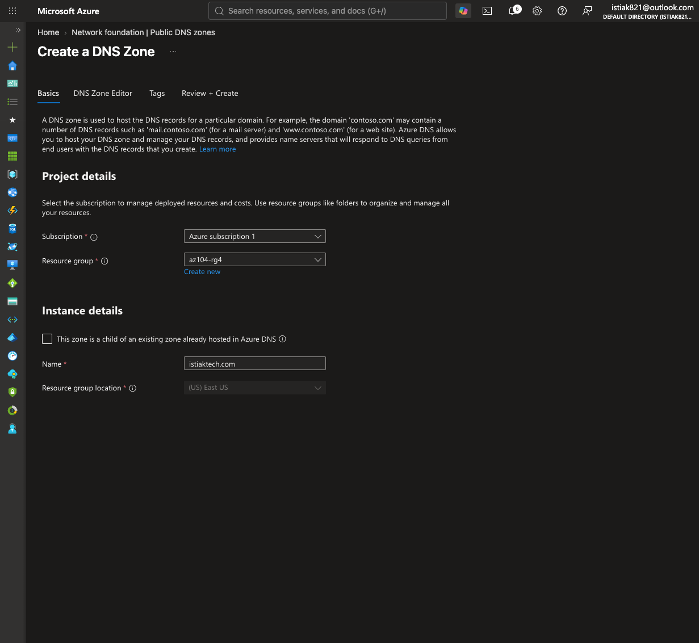
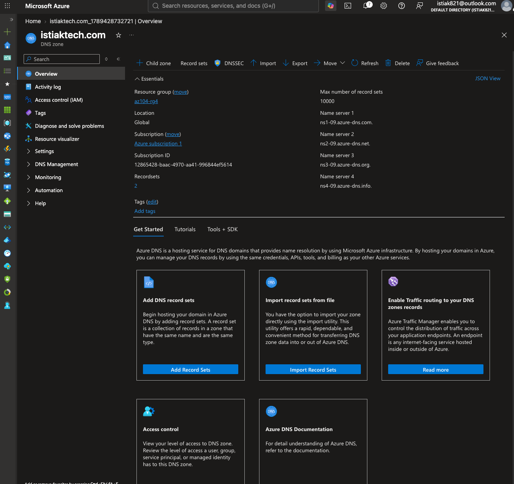
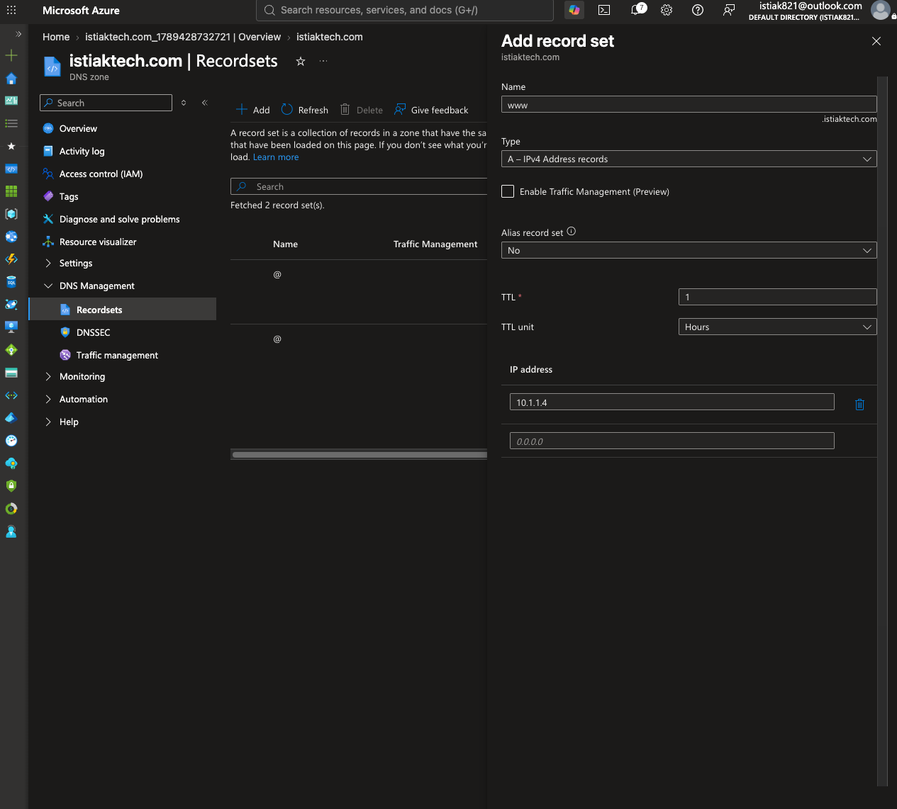
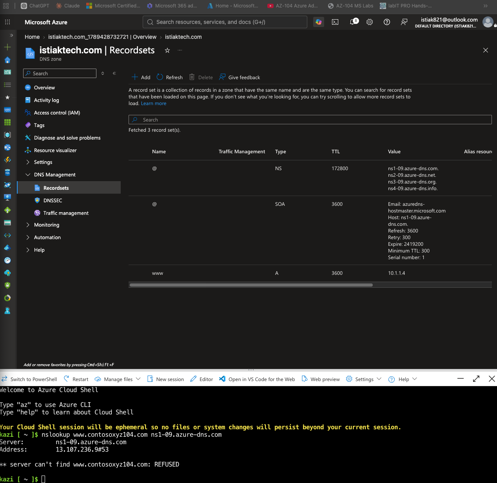
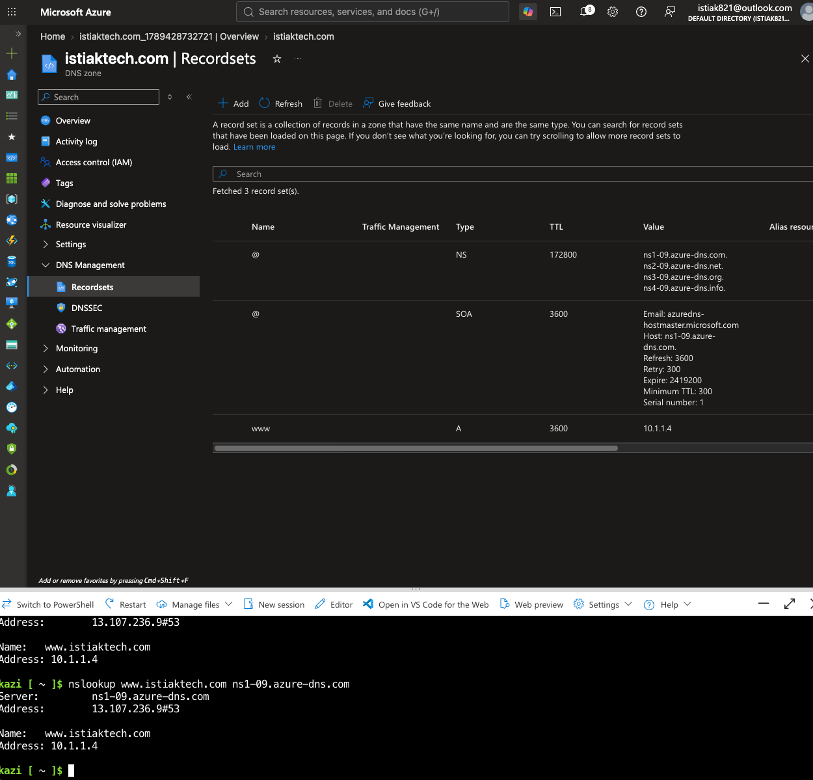
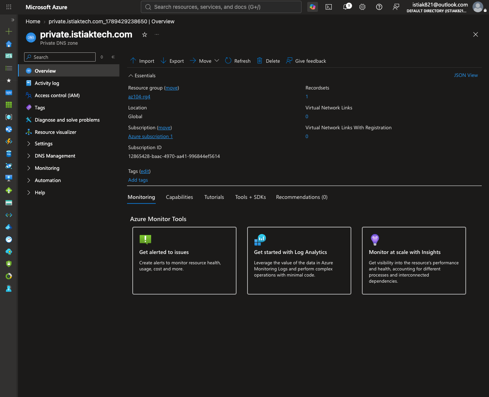
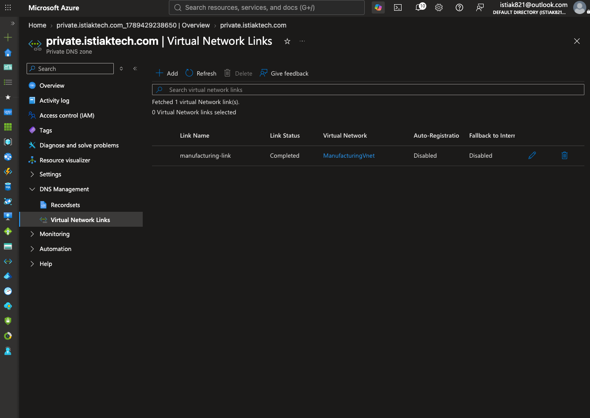
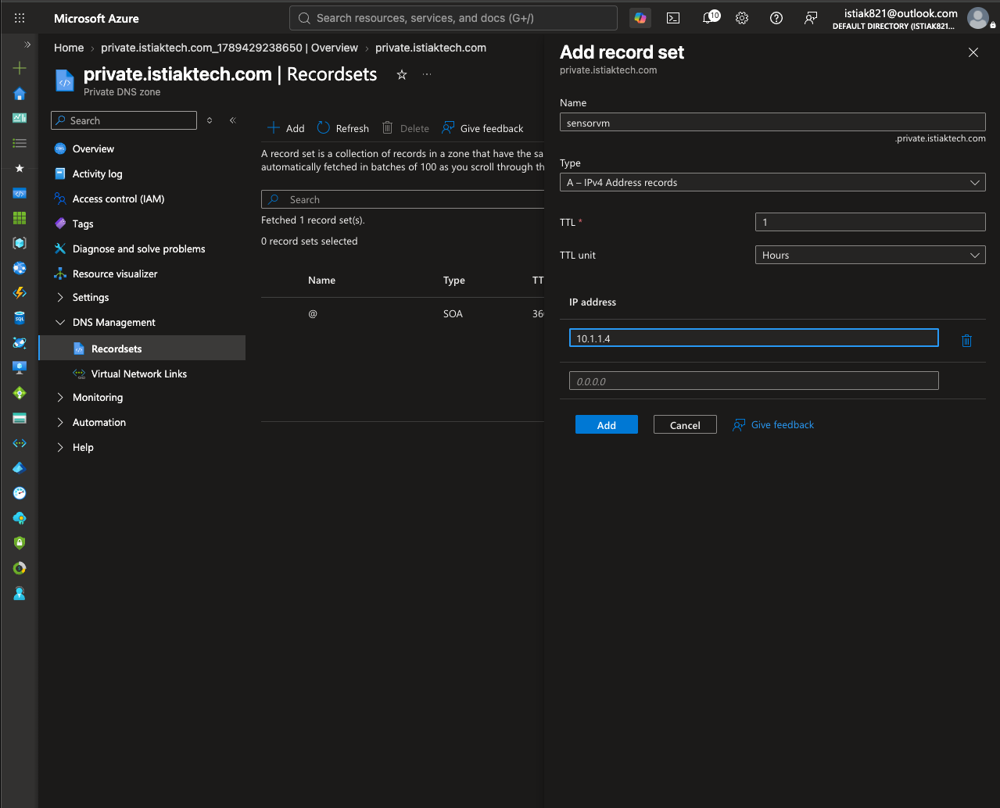

# Lab 04 — Azure DNS: Public Delegation & Private Resolution

## 🎯 Objective

Configure both a public-facing DNS zone (with real name-server delegation and record verification) and a private DNS zone scoped to an internal virtual network, to demonstrate the two distinct name-resolution models Azure DNS supports.

---

## 🌐 Public DNS Zone

| Setting | Value |
|---------|-------|
| Zone | `istiaktech.com` |
| Resource Group | `az104-rg4` |
| Record created | `www` (A record) → `10.1.1.4` |



Azure automatically assigned four name servers to the zone on creation — this is the delegation set that a domain registrar would need to point to in order for the zone to actually serve public DNS traffic for the domain:



```
ns1-09.azure-dns.com.
ns2-09.azure-dns.net.
ns3-09.azure-dns.org.
ns4-09.azure-dns.info.
```



### Verification — Including a Real Failed Query

The first verification attempt used a domain name copied directly from the lab's example instructions rather than the zone actually created, and correctly failed:



```
nslookup www.contosoxyz104.com ns1-09.azure-dns.com
** server can't find www.contosoxyz104.com: REFUSED
```

`REFUSED` here is the expected behavior, not a misconfiguration — the queried name server genuinely does not host that zone. Correcting the query to the actual zone name resolved successfully:



```
nslookup www.istiaktech.com ns1-09.azure-dns.com
Server:   ns1-09.azure-dns.com
Address:  13.107.236.9#53

Name:     www.istiaktech.com
Address:  10.1.1.4
```

---

## 🔒 Private DNS Zone

| Setting | Value |
|---------|-------|
| Zone | `private.istiaktech.com` |
| Linked VNet | `ManufacturingVnet` (link name: `manufacturing-link`) |
| Record created | `sensorvm` (A record) → `10.1.1.4` |



Note what's *absent* from this overview compared to the public zone: no name servers are listed. A private zone is never delegated on the public internet — it's only resolvable from VNets it's explicitly linked to.



The link to `ManufacturingVnet` shows status **Completed**, with auto-registration left disabled (records were added manually for this lab rather than relying on VM auto-registration).



---

## 🧠 Key Concepts Demonstrated

- **Domain delegation model** — a public Azure DNS zone is only authoritative for a domain once a registrar's NS records point to Azure's assigned name servers; Azure hosts the zone, it does not sell or register the domain itself
- **Record management** — creating A records in both zone types and understanding TTL as a caching duration, not a resolution mechanism
- **Zone-type isolation** — private zones expose no public name servers and are unreachable from the internet by design; resolution is scoped entirely to linked VNets
- **Virtual network links** — the mechanism that makes a private zone resolvable from inside a specific VNet, with optional auto-registration for VM lifecycle-driven record management
- **Practical troubleshooting** — reading a `REFUSED` nslookup response correctly (wrong zone queried) rather than assuming the DNS zone itself was broken

---

## 💡 What I Learned

The failed `nslookup` attempt turned out to be a more instructive moment than a clean first-try success would have been. A `REFUSED` response is specific — it means the name server was reached and responded, but explicitly declined to answer for that zone. Recognizing that distinction (versus, say, a timeout or `NXDOMAIN`) is the kind of detail that matters when triaging real DNS issues, where the failure mode itself tells you where to look next.
